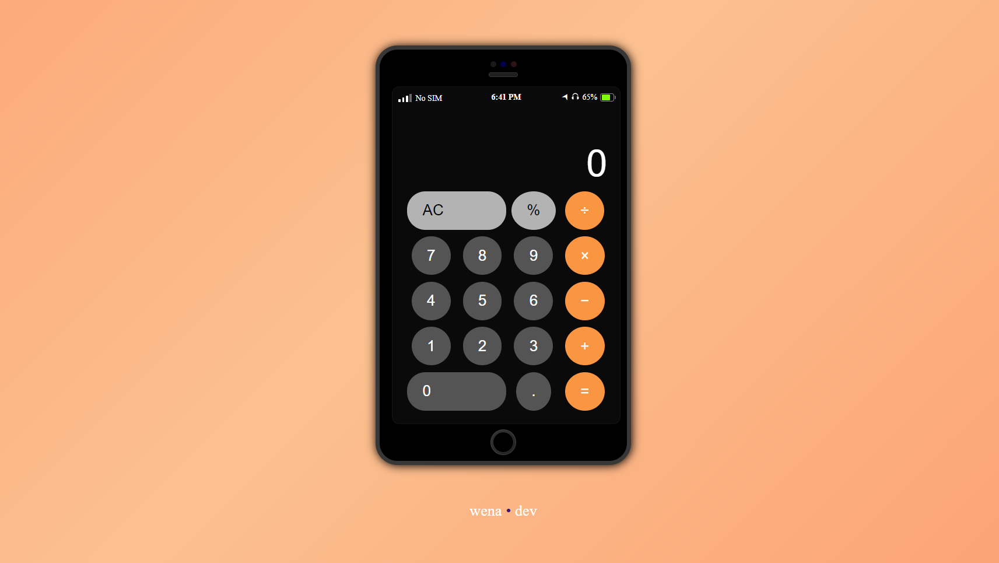

<!-- Please update value in the {}  -->

<h1 align="center">Basic Calculator</h1>

   Solution for a challenge from  <a href="https://www.shecodeafrica.org/" target="_blank">SheCode Africa</a>.

  <h3>
    <a href="https://simple-calculator-code.netlify.app" target="_blank">
      Demo
    </a>
  </h3>

<!-- OVERVIEW -->

## Overview

### Built With

<!-- This section should list any major frameworks that you built your project using. Here are a few examples.-->

- HTML5 
- CSS3
- JavaScript

## Contact

- Website [Temitayo Hayes' Portfolio](https://https://wenadev-portfolio.web.app/)
