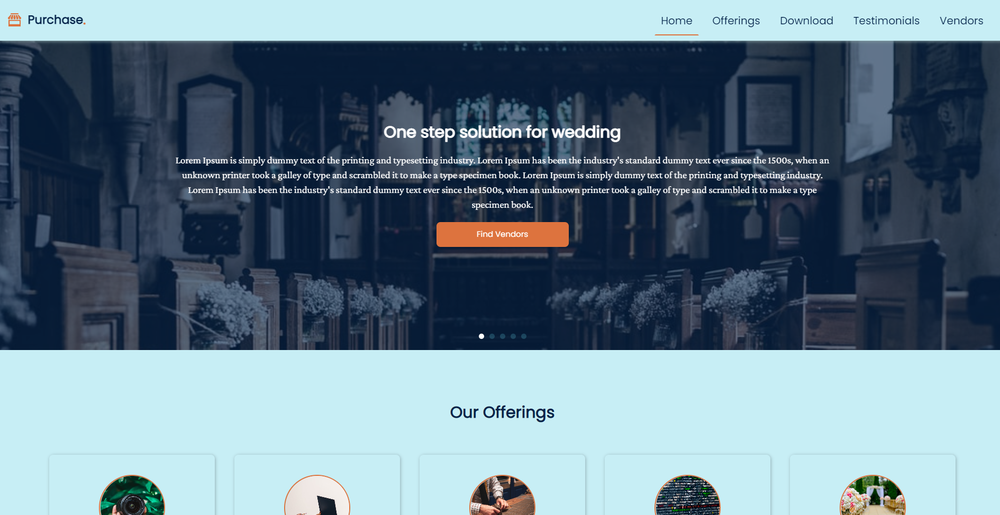

<!-- Please update value in the {}  -->

<h1 align="center">High Fidelity Wireframing</h1>

   Solution for a challenge from  <a href="https://www.shecodeafrica.org/" target="_blank">SheCode Africa</a>.

  <h3>
    <a href="https://high-fidelity-wireframing.netlify.app/" target="_blank">
      Demo
    </a>
     | 
    <a href="https://dribbble.com/shots/11350923-High-Fidelity-Wireframing/attachments/2963018?mode=media" target="_blank">
      Challenge
    </a>
  </h3>

<!-- OVERVIEW -->

## Overview

### Built With

<!-- This section should list any major frameworks that you built your project using. Here are a few examples.-->

- HTML 
- CSS Grid
- Flexbox
- [Swiper.js](https://swiperjs.com/)

## Contact

- Website [Temitayo Hayes' Portfolio](https://https://wenadev-portfolio.web.app/)
